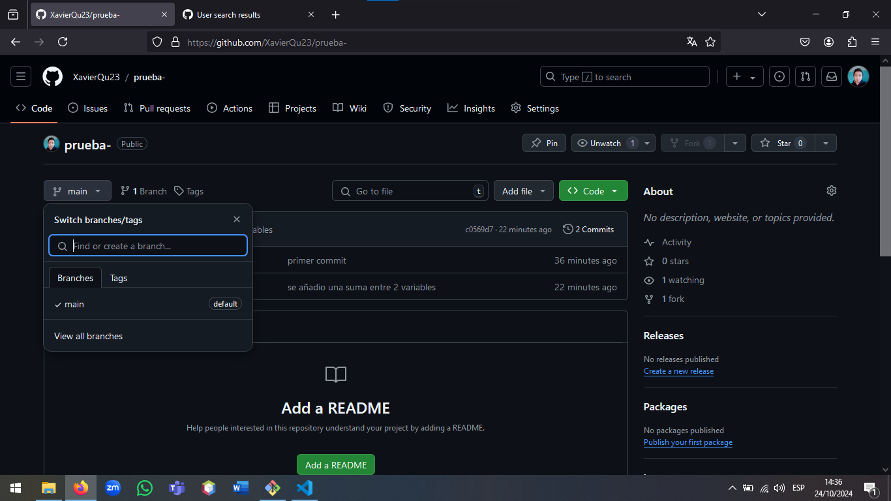

# Este es un título
## Este es un subtitulo
xd

hola

```
git init 

```
---
___
`git status`


* primer elemento
* segundo elemento
* tercer elemento

1. elemento 1
2. elemento 2
3. elemento 3

[youtube](https://youtube.com "click to go a youtube")


